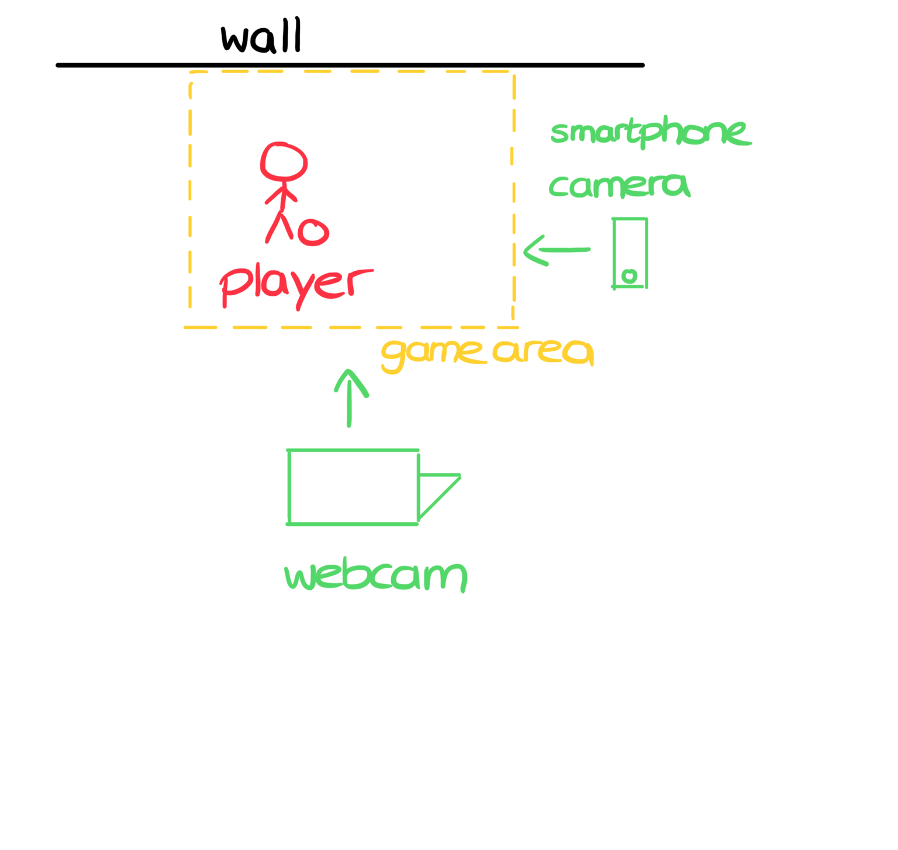
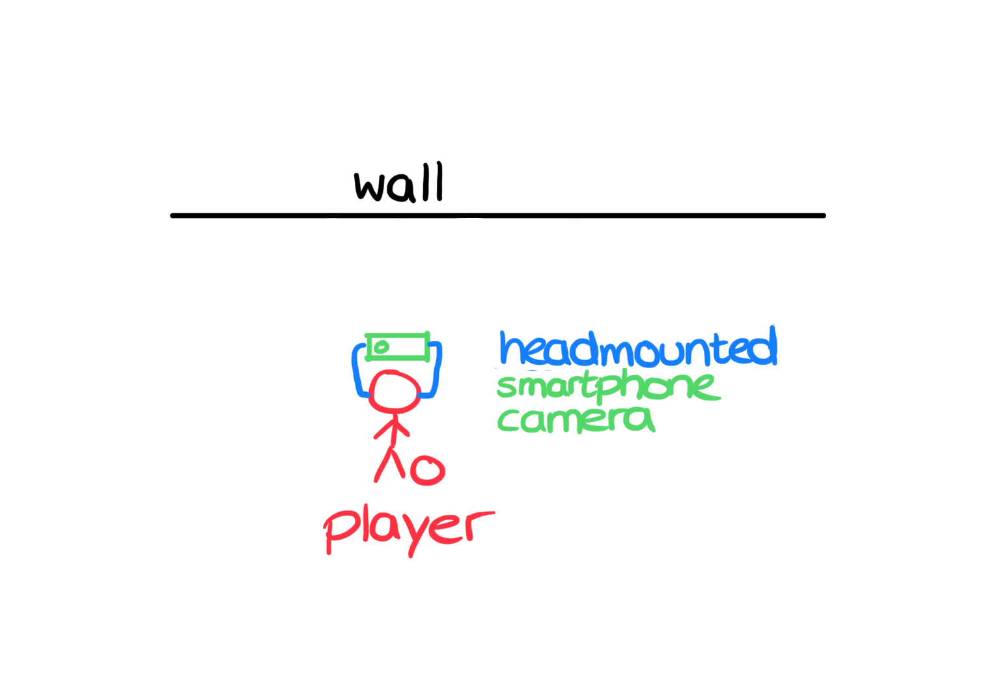

# Footbonaut2Go: A Real-time Mixed Reality application for Ball Sports
By [Raffael Rizzo](https://github.com/raffaelrizzo) [Anna Braun](https://github.com/superintelligence-lab) [Chihiro Tone](https://github.com/toneDrei79)

In this repository, we present a real-time Mixed Reality application for Sports, including two approaches for tracking the position of a ball in 3D space. This project utilizes a Tensorflow Model, Python and OpenCV for the ball tracking and determining the ball's position in 3D space, Unity to create the Mixed Reality sports application and the UDP protocol to enable the two previous parts to communicate with each other, forming a complex and exciting MR-enabled application.


We made a [[YouTube video]](https://youtu.be/RQjTT2h5Tfc) showcasing our project.


# Table of Contents
1. [Theoretical Background](#theoretical-background)
   1. [Modern Sport Facilities](#modern-sport-facilities)
   2. [Research](#research)
2. [Ball Tracking Approaches](#ball-tracking-approaches)
3. [Requirements](#requirements)
   1. [Software](#software)
   2. [Hardware](#hardware)
4. [Installation](#installation)
5. [How to Run](#how-to-run)
   1. [First Approach: Two Camera Detection (stationary)](#first-approach-two-camera-detection-stationary)
   2. [Second Approach: Single Camera Detection (dynamic)](#second-approach-single-camera-detection-dynamic)
6. [Summary](#summary)
7. [Acknowledgements](#acknowledgements)


## Theoretical Background
### Modern Sport Faciilities
Professional football clubs like Borussia Dortmund, Benfica Lissabon or Paris St. Germain all use high-tech training devices such as the Footbonaut to improve the ball pass accuracy and reaction times of their players. The Footbonaut is a field where the player gets the ball from one of the eight throwing machines. The player has to hit the ball into a random square that lights up. 

### Research
Studies like *Relationship between ball possession and match outcome in UEFA Champions League* by *Farias et al.* have shown that there is a significant relationship between ball possession and match outcomes. *Dellal et al.* showed in their study *Small-sided games in soccer: amateur vs. professional players' physiological responses, physical, and technical activities* that amateur football players completed fewer successful passes and lost more possessions compared to international, elite football players.
These findings suggest that professional football players perform more exercises, that train a fast action time, high accuracy of passing, and distinctive technique (such as training with the Footbonaut) than amateur football players. 
This also suggests that amateur football players could improve these technical skills through dedicated training to tackle these difficienices, such as by using the Footbonaut. However, training facilities like the Footbonaut can cost hundreds of thousands of Euros, making them an unfeasable option for amateur soccer clubs.
By democratizing the Footbonaut, the performance gap between amateur and professional football players can be reduced.

For this, we created a Mixed Reality application in Unity, that enables football players equipped with a physical football and standing in front of a wall to see multiple rectangles projected virtually onto the wall in front of them. One of the rectangles lights up randomly and the player has to quickly hit the ball against the t this exact spot. If the player doesn't hit the wall at the correct spot, an error sound is played, while a celebratory sound appears and the score is increased once the player hits the ball inside the litted rectangle.
Unfortunately, Meta does not allow developers to access the passthrough mode of their headsets. This meant that we had to find another way to determine the location of the ball in 3D space.

## Ball Tracking Approaches
To track the location of the ball, we came up with two different ball tracking approaches, which both provide a great accuracy for determining the football's current position in 3D space and whether the football was hit onto the correct location of the wall or not.

- The first approach uses 2 stationary cameras that are placed in front and to the side of the wall and using a tensor flow model. Here is a picture that visualizes the setup we used for this approach: 


- The second approach requires only one camera that can be held in the hands or attached to the head of the player and that uses a different deep learning model. This approach is much more dynamic, but both are very accurate and can be installed using just simple smartphone cameras. Here is a picture that visualizes the setup we used for this approach: 


## Requirements

Before getting started, ensure you have the following software and hardware requirements:

### Software
1. **Python**: The scripts are written in Python. Make sure you have Python 3.6 or later installed on your machine.
2. **OpenCV**: This is used for real-time computer vision.
3. **TensorFlow**: It's utilized for the Ball Detection Model.
4. **Argparse**: Used for command-line option and argument parsing.
5. **Socket**: Enables the network connections.
6. **NumPy**: Fundamental package for scientific computing with Python.
7. **Unity**: Needed to run the MR Footbonaut project.
8. **UDP_Receiver Unity Script**: Handles the transfer of position data via UDP.

### Hardware
1. **VR Headset**: With passthrough enabled.

## Installation

Here are the steps to install the necessary libraries and dependencies:

1. **Python**
   
   Python can be installed from the official website: https://www.python.org/downloads/

2. **OpenCV, TensorFlow, Argparse, Socket, NumPy**

   These Python libraries can be installed using pip. Run the following command in your terminal:

   ```shell
   pip install opencv-python tensorflow argparse socket numpy
   ```

   For single camera direction, you also need to install following libraries:

   ```shell
   pip install depthai matplotlib
   ```

3. **Unity**
   
   You can download and install Unity from its official site: https://unity.com/download

4. **Clone this repository**

   Navigate to your desired directory via terminal and clone this repository with the command:

   ```shell
   git clone <https://github.com/raffaelrizzo/Mixed-Reality-Real-Time-Ball-Tracking-.git>
   ```

## How to Run

### First Approach: Two Camera Detection (stationary)

Here's the step-by-step process to get the project up and running:

1. **Update the IP Address**
   
   Both the Python script and the UDP_Receiver script that is attached to the Sphere in the Unity scene require the IP address. Make sure to update the IP address in both scripts accordingly.

2. **Run the Ball Detection Script**
   
   Navigate to the "BallDetection Python" folder in your terminal and run the "BallDetection_4Point_Calibration_2Cameras_dynamic" script:

   ```shell
   python BallDetection_4Point_Calibration_2Cameras_dynamic.py
   ```

3. **Open the Unity Scene**
   
   Now, navigate to the "MR Footbonaut" folder and open the "Dynamic_Footonaut.unity" scene.

4. **Run the Unity Scene**
   
   With the Unity scene open, and your VR headset with passthrough enabled, press the Play button in Unity to run the scene.

Congratulations! You are now operating a complex VR application, capable of detecting ball positions in real-time and immersing you in the virtual MR Footbonaut experience.

### Second Approach: Single Camera Detection (dynamic)

The camera must be installed on the headset physically. **The ball can be only detected while the player looking towords it.**

Here's the step-by-step process to get the project up and running:

```shell
cd Balldetection\ Python/SingleCamera/
```

1. **Update the IP Address**
   
   Both the Python script and the UDP_Receiver script that is attached to the Sphere in the Unity scene require the IP address.

2. **Calibrate the camera**

   This position estimation system is based on the following calibrations. At first, check that the external camera is connected properly by running the following:

   ```shell
   python preview.py
   ```

   You have to mesure the width and height of the video 1m away from camera.

   Then you start calibration. The calibration system will automatically capture a sample frame every 5 seconds. At each time, capture the ball at a distance of [0.4, 0.6, 0.8, 1.0, 1.2, 1.5, 2.0, 2.5, 3.0] m from the camera.
   
   Note that you need to add arguments **unitwidth** and **unitheight** [m] which you mesured at the last step.

   ```python
   python calibrate.py --capture --unitwidth XX --unitheight YY
   ```

   The calibration data will be saved in calibata/00/ by default.

3. **Run the Ball Detection Script**

   Note that you need to add arguments **calibdata** which you saved at the last step and **serverip**.

   ```shell
   python balltraker.py --preview --calibdata xx/xx/parameters.json --serverip xxx.xxx.xxx.xxx
   ```

4. **Open the Unity Scene**
   
   Now, navigate to the "MR Footbonaut" folder and open the "Dynamic_Footonaut.unity" scene.

   Note that the sphere must be a child of **CenterEyeAnchor** object in Unity scene hieralchy.

5. **Run the Unity Scene**
   
   With the Unity scene open, and your VR headset with passthrough enabled, press the Play button in Unity to run the scene.

## Summary
This repository represents a proof of concept that demonstrates the power and possibility of combining real-time image processing with mixed reality. However, as it stands, the implementation requires two powerful computers and two cameras to function effectively. An intriguing direction for future exploration would be how to streamline and optimize image processing techniques to be more suitable and efficient for mixed reality applications.

## Acknowledgements
We would like to express our profound gratitude to our Professor Philippe Colantoni for providing invaluable guidance this project. 

If you have any issues or feedback, please open an issue on this GitHub repository. Contributions are also welcome! Please feel free to fork this repository and submit a pull request with your changes. Happy coding!

You can connect with us by writing an e-mail to *superintelligence.contact@proton.me*
